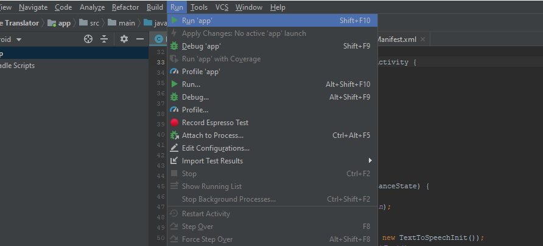
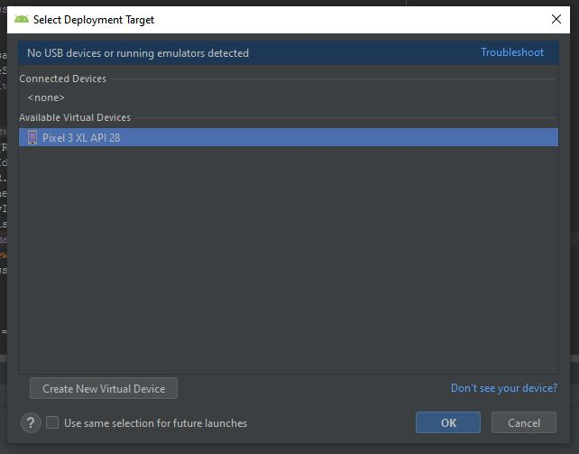
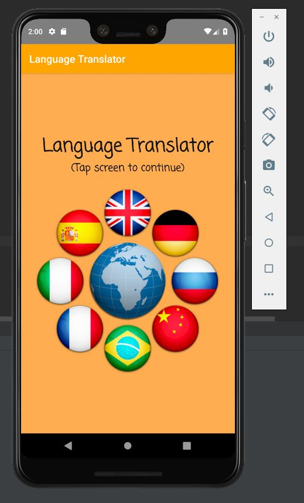
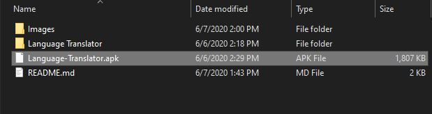
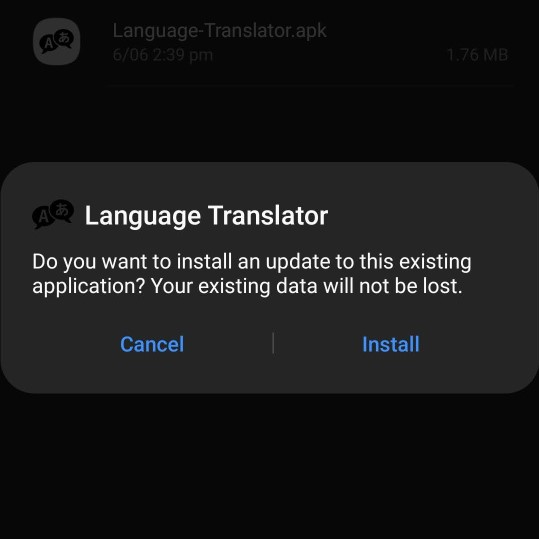
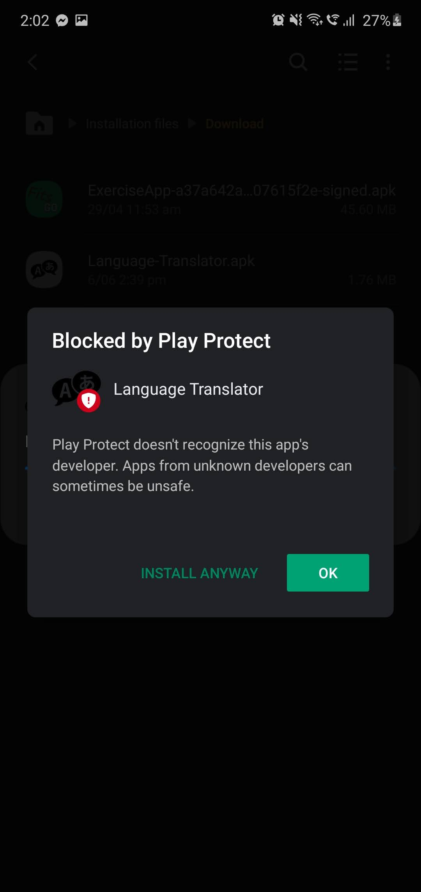
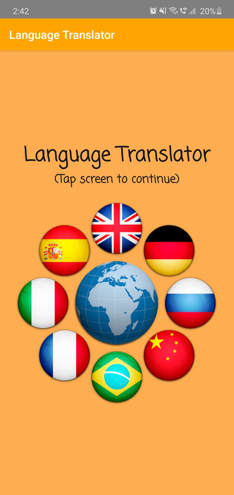
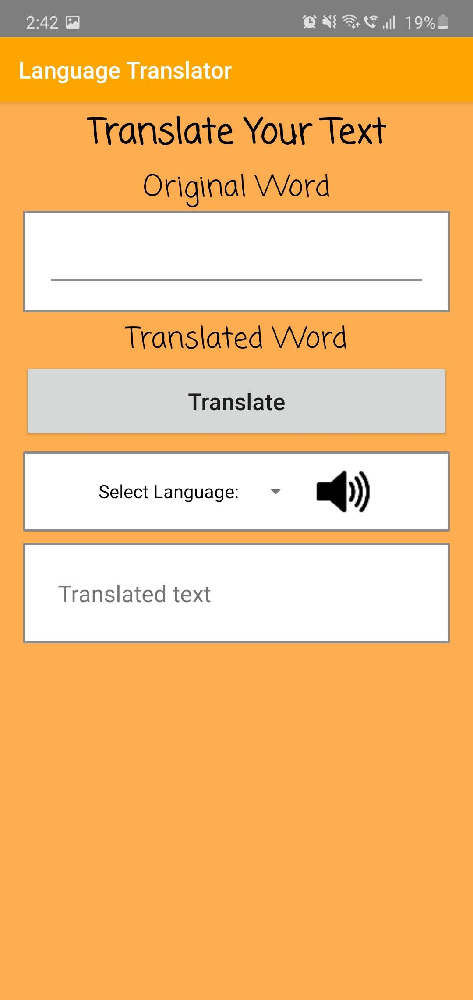
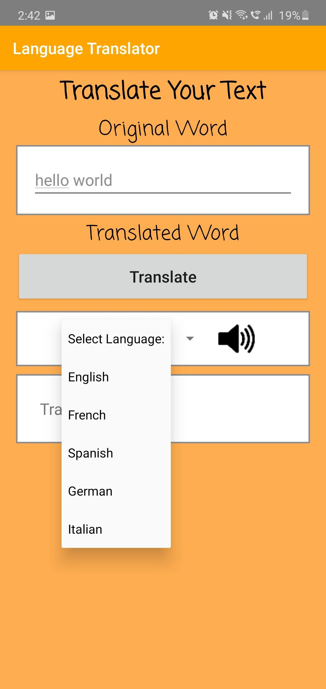
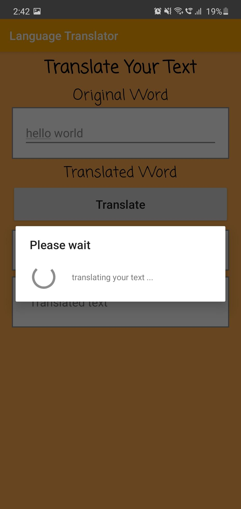

# Language-Translator
Android app that can translate English text to 5 different languages with text-to-speech functionality. This Android application will allow the user to input text into the textbox which will then be translated to a different language. The user will then select from 5 different languages which include; English, French, Spanish, German and Italian. The app uses the translate.yandex API to translate the user input text into different languages. Link to the translate.yandex API can be found below. This application was developed as part of the Otago Polytechnic Bachelor of Information Technology Mobile paper (IN).

translate.yandex: https://translate.yandex.com/developers

## Installation
The project source code can be open using Andriod Studio. From there you can use the built-in compiler to run the application on your chosen android phone emulator, that has been previously installed, install a new emulator through Android Studio. You can also install the application on your Andriod phone by copying the .apk file located in the home directory of the repo (Language-Translator.apk) into your phone. From there you can install the application on your phone using the .apk file.

### Andriod Studio Method
1. Open the project source code in Android Studio. Once the project completely loads and the project is ready. Click 'run app' under the run tab in the toolbar located at the top of the screen.

2. Select the Andriod phone emulator that you want to run the application on. If there are no available emulators. You will have to install one using Android Studio. Click 'Create New Virtual Device' located at the bottom left of the screen and follow the installation wizard.

3. Wait till the emulator starts up and the application should start up on the emulator automatically. If not, the application will be located in the application tray of the phone.

### APK File Method
1. Download the .apk file (Language-Translate.apk) located in the home directory of this repo. Transfer this file onto your Android phone using a USB cable.

2. Locate the .apk file on your phone and open it. Tap 'install' and the installation process of the application will begin.

3. Click 'install anyway'

## Technologies Used
Java  
translate.yandex (API)  
Andriod Studio

## Application

### Welcome Screen

### Home Screen

### Language Select 

### Word Translating

### Word Translated

